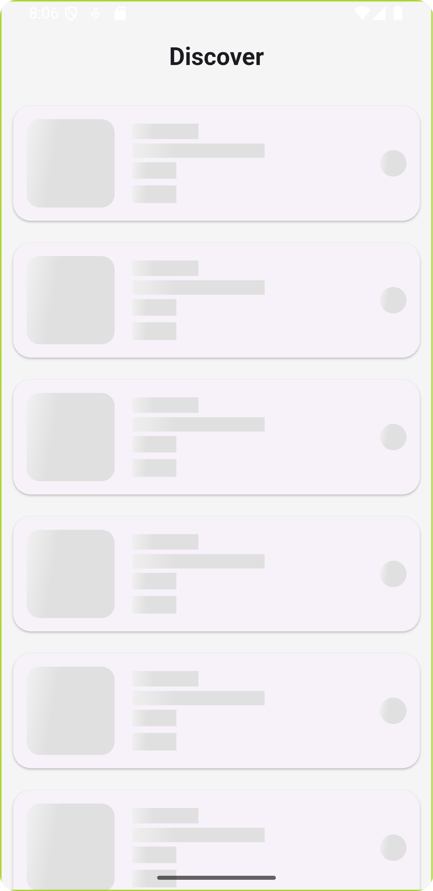
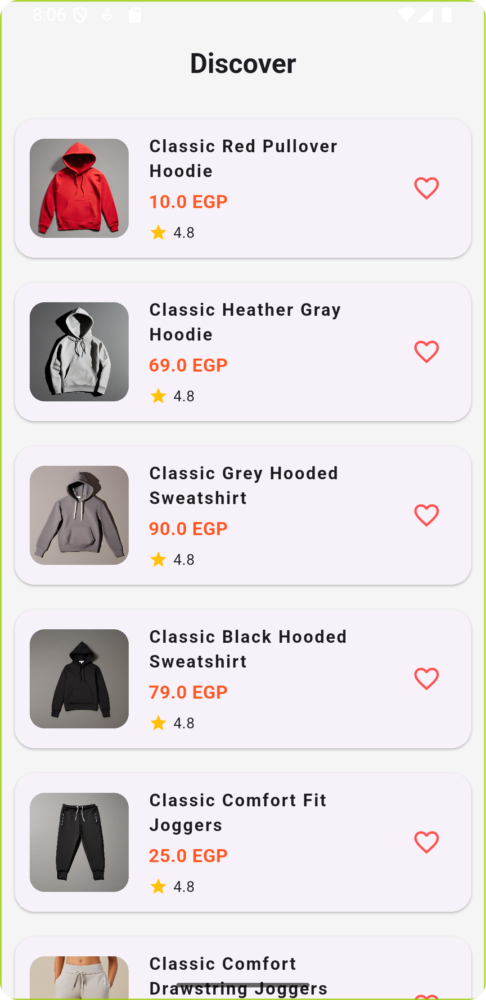

# Linked-Gates-task

## Project Overview

**Linked-Gates-task** is a modern Flutter e-commerce demo app that displays a list of products fetched from an API. It features a clean, responsive UI, shimmer loading effects, robust error handling, and follows best practices for state management and architecture (using Cubit/BLoC and Clean Architecture principles).

## Screenshots

<p align="center">
  
  &nbsp;&nbsp;
  
</p>
## Steps to Run the Project

1. **Clone the repository:**
   ```bash
   git clone https://github.com/Ahmed336-cell/Linked-Gates-task.git
   cd apitask
   ```

2. **Install dependencies:**
   ```bash
   flutter pub get
   ```

3. **Run the app:**
   ```bash
   flutter run
   ```
   > You can run on an emulator or a physical device.

## Additional Libraries/Packages Used

- [flutter_bloc](https://pub.dev/packages/flutter_bloc): State management (Cubit/BLoC)
- [get_it](https://pub.dev/packages/get_it): Dependency injection
- [dio](https://pub.dev/packages/dio): Networking
- [dartz](https://pub.dev/packages/dartz): Functional programming (Either type for error handling)
- [cached_network_image](https://pub.dev/packages/cached_network_image): Efficient image loading and caching
- [shimmer](https://pub.dev/packages/shimmer): Shimmer loading effect for images and list items
- [flutter_staggered_grid_view](https://pub.dev/packages/flutter_staggered_grid_view): (Optional) For grid layouts

## Features
- Modern, responsive product list UI
- Shimmer loading for smooth transitions
- User-friendly error handling with retry
- Clean architecture and modular code

---

Feel free to customize this README for your own project or add more details as needed!
